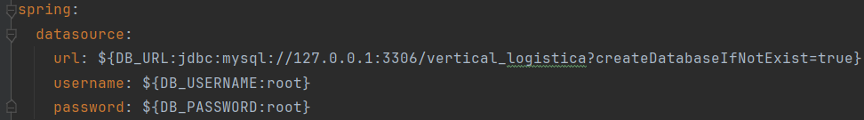
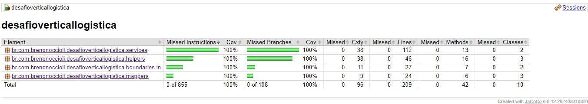
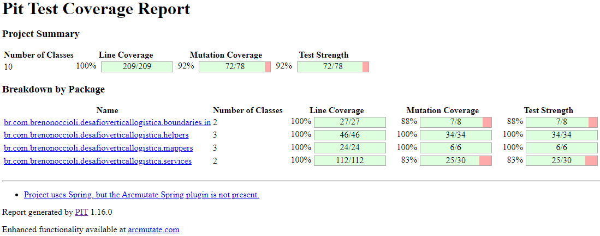
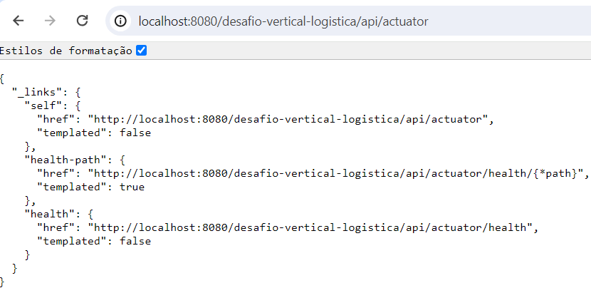

# **Desafio**

## Descrição
Esta API é a solução da proposta de um desafio técnico, que consiste no processamento de arquivos de texto para 
persistência e consulta das informações de pedidos de compra de produtos por usuários.
O arquivo segue uma estrutura em que cada linha representa uma parte de um pedido. Respeitando o seguinte padrão:

| **Campo**        | **Tamanho** | **Tipo**           |
|------------------|-------------|--------------------|
| id usuário       | 10          | numérico           |
| nome             | 45          | texto              |
| id pedido        | 10          | numérico           |
| id produto       | 10          | numérico           |
| valor do produto | 12          | decimal            |
| data da compra   | 8           | numérico (yyyMMdd) |

Exemplo de payload do arquivo de texto:
````
0000000001                                 Nome Usuario00000001110000000001     1000.1020240105
0000000002                                 Nome Usuario00000001110000000011     1111.1120240105
````

# Regras implementadas
- Cada usuário deve ser único e pode possuir 'n' pedidos;
- Cada pedido deve ser único e pertencer a apenas um usuário;
- Produtos não possuem id único, podendo estar atrelados a pedidos diferentes inclusive com valores diferentes;
- Como produtos podem possuir preços diferentes para o mesmo id, podem existir produtos com o mesmo id dentro de um mesmo pedido;
- O arquivo deve ser processado o quanto for possível. Dessa forma, as linhas com informações inválidas foram desprezadas,
mas podem ser consultadas via log da aplicação;
- O filtro por intervalo de data é opcional na consulta, mas quando informado ambos os parâmetros passam a ser obrigatórios.

# Como executar
- Execute o banco de dados relacional de sua preferência (aqui foi utilizado MySQL);
- Defina url, usuário e senha do seu banco de dados no arquivo [application.yaml](src%2Fmain%2Fresources%2Fapplication.yaml):

- Pronto! A aplicação está pronta para ser executada e você pode acessar os endpoints pela url
``http://localhost:8080/desafio-vertical-logistica/api/{endpoint}``.

# Como testar
## Testes unitários
Execute o comando ``mvn test`` e verifique o relatório gerado em 
``DesafioVerticalLogistica -> target -> site -> index.html``



## Testes mutantes
Execute o comando ``mvn test-compile org.pitest:pitest-maven:mutationCoverage``
e verifique o relatório gerado em ``DesafioVerticalLogistica -> target -> pit-reports -> index.html``



## Testes de API
A collection com as chamadas desta API estão disponíveis em
``DesafioVerticalLogistica -> docs -> collections ->``[conllection-desafio-Insomnia_2024-05-01](collections%2Fconllection-desafio-Insomnia_2024-05-01)

## OpenAPI
Você pode acessar a documentação dos endpoints desta API em
``DesafioVerticalLogistica -> docs -> openapi ->``[openapi.yaml](opeanapi%2Fopenapi.yaml)

# HealthCheck
Para verificar o healthcheck, execute a aplicação e acesse
``http://localhost:8080/desafio-vertical-logistica/api/actuator``

